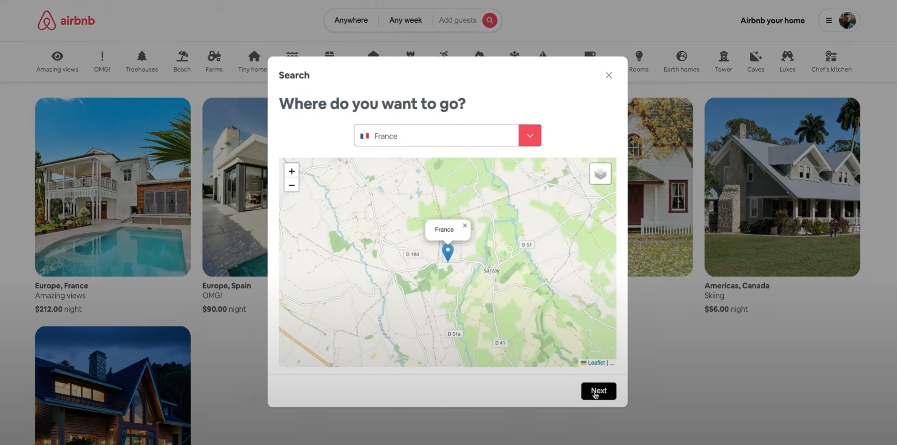
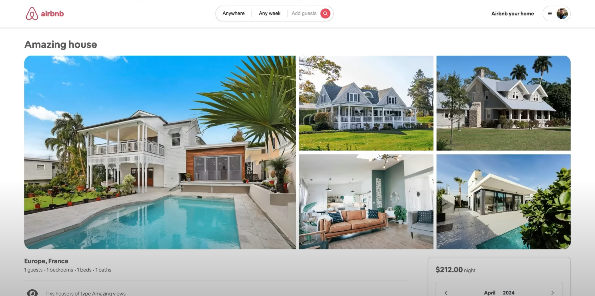
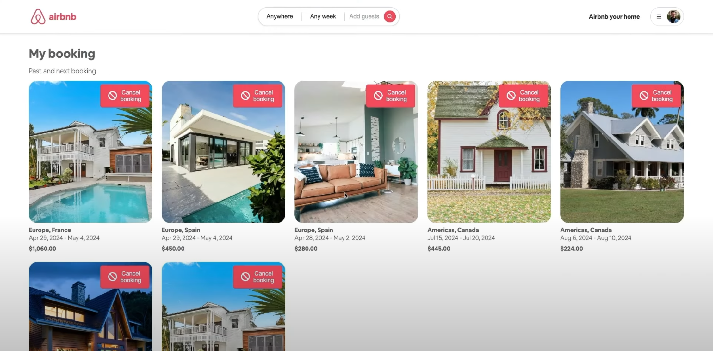

# Airbnb Clone
<a name="readme-top"></a>
<!-- PROJECT LOGO -->
<br />
<div align="center">

<h3 align="center">Full Stack Airbnb Clone</h3>

  <p align="center">
    A full stack Airbnb clone application using Angular for the frontend, Spring Boot Java for the backend, PostgreSQL as the database, and Auth0 for authentication and authorization. The application includes booking management for travelers, reservation management for landlords, and comprehensive search functionalities.
  </p>
</div>


<!-- TABLE OF CONTENTS -->
<details>
  <summary>Table of Contents</summary>
  <ol>
    <li>
      <a href="#about-the-project">About The Project</a>
      <ul>
        <li><a href="#built-with">Built With</a></li>
      </ul>
    </li>
    <li><a href="#roadmap">Roadmap</a></li>
    <li><a href="#instructions">Instructions</a></li>
    <li><a href="#screencaps">Screencaps</a></li>
  </ol>
</details>


<!-- ABOUT THE PROJECT -->
## About The Project


The project focuses on creating a full stack Airbnb clone application. The backend is built with Spring Boot Java, interfacing with a PostgreSQL database. The frontend is developed with Angular, providing a dynamic and responsive user interface. The application includes full user authentication and authorization with Auth0, supporting role management. It features booking management for travelers, reservation management for landlords, and search functionalities by various criteria like location, date, and number of guests.

The project is deployed on an AWS EC2 instance self-hosted through Coolify. For the CI/CD process, I implemented Github actions to automatically create frontend and backend docker image is pushed to my docker hub and redeployed through Coolify.

## [Live Demo 🔗](https://airbnb.ryanlepham.com/)

<p align="right">(<a href="#readme-top">back to top</a>)</p>


### Built With

* [![Java][Java.java]][Java-url]
* [![SpringBoot][SpringBoot]][Spring-url]
* [![Maven][Maven]][Maven-url]
* [![PostgreSQL][PostgreSQL]][PostgreSQL-url]
* [![Angular][Angular]][Angular-url]
* [![Auth0][Auth0]][Auth0-url]
* [![Docker][Docker]][Docker-url]
* [![EC2][EC2]][EC2-url]
* [![Hetzner][Hetzner]][Hetzner-url]
* [![Coolify][Coolify]][Coolify-url]

<p align="right">(<a href="#readme-top">back to top</a>)</p>

<!-- ROADMAP -->
## Roadmap

- ✔️ Implement user authentication and authorization with Auth0
- ✔️ Develop a dynamic frontend using Angular
- ✔️ Build a robust backend with Spring Boot and PostgreSQL
- ✔️ Implement booking management for travelers
- ✔️ Implement reservation management for landlords
- ✔️ Develop search functionalities by location, date, guests, and other criteria
- ✔️ Utilize Docker for containerized deployment and easy setup across different environments
- ✔️ Deployed on AWS EC2 and self-hosted through Coolify
- ️️✔️ Migrated cloud server to Hetzner Cloud to reduce costs by 50%
- ✔️ Used Github Actions for CI/CD to automatically create and push docker image of app backend


<p align="right">(<a href="#readme-top">back to top</a>)</p>


<!-- INSTRUCTIONS -->
## Instructions for Local Setup

#### 1) Setup .env file from .env.example

```js
AUTH0_CLIENT_ID=
AUTH0_CLIENT_SECRET=
```

##### Auth0 Setup

- Create a Java Sprinboot Auth0 application. Ensure the following details are added:
  - Under application settings:
    - Replace ```Domain```, ```Client ID```, ```Client Secret``` on ```application.yml``` (inside server/src/main/resources and .env above)
    - Allowed Callback URLs: ```http://backend:8080/login/oauth2/code/okta```, ```http://localhost:8080/login/oauth2/code/okta```, ```http://localhost:4200/login/oauth2/code/okta```, ```http://frontend:4200/login/oauth2/code/okta```
    - Allowed Logout URLs and Allowed Web Origins: ```http://localhost:4200```
    - Allow Cross-Origin Authentication and CORS: ```http://localhost:4200```
  - Under Application APIs Machine To Machine Applications:
    - Ensure Permissions are on for:
      - read:client_grants, create:client_grants, delete:client_grants, update:client_grants, read:users, update:users, delete:users, create:users, read:users_app_metadata, update:users_app_metadata, create:users_app_metadata, read:roles, update:roles, read:role_members
  - Under User Management Roles:
    - Ensure Roles are created for:
      - ```ROLE_ADMIN```, ```ROLE_LANDLORD```, ```ROLE_TENANT```
      - Under  ```ROLE_Landlord```, get the Role ID and replace that in the application.yml


<br/>

#### 2a) Docker Installation (Recommended)
- Ensure Docker is installed and running on your system
    - See https://docs.docker.com/ for installation instructions
1) Build the Docker image and ensure no previous cache is used:
    - ```docker-compose build --no-cache```
2) Compose the Docker image:
    - ```docker-compose up```

    <br/>
    <br/>


#### 2b) Manual Installation
  - Client frontend:
      1) ```npm install```
      2) ```ng serve```
  - Server backend:
      1) ```maven clean install```
      2) ```mvn spring-boot:run```


- In the case that there are duplicate tables in the airbnb_clone database:
  - In ```server/src/main/resources/application.yml``` uncomment 
    - ```drop-first: true```
  - Run the application
    - ```mvn spring-boot:run```
  - Recomment ```drop-first: true``` for future runs

<p align="right">(<a href="#readme-top">back to top</a>)</p>

<!-- SCREENCAPS -->
## Screencaps






<p align="right">(<a href="#readme-top">back to top</a>)</p>


[Java.java]: https://img.shields.io/badge/java-%23ED8B00.svg?style=for-the-badge&logo=openjdk&logoColor=white
[Java-url]: https://www.java.com/en/
[Maven]: https://img.shields.io/badge/Apache%20Maven-C71A36?style=for-the-badge&logo=Apache%20Maven&logoColor=white
[Maven-url]: https://maven.apache.org/
[SpringBoot]: https://img.shields.io/badge/spring-%236DB33F.svg?style=for-the-badge&logo=spring&logoColor=white
[Spring-url]: https://spring.io/projects/spring-boot
[PostgreSQL]: https://img.shields.io/badge/PostgreSQL-316192?style=for-the-badge&logo=postgresql&logoColor=white
[PostgreSQL-url]: https://www.postgresql.org/
[Angular]: https://img.shields.io/badge/angular-%23DD0031.svg?style=for-the-badge&logo=angular&logoColor=white
[Angular-url]: https://angular.io/
[Docker]: https://img.shields.io/badge/docker-%230db7ed.svg?style=for-the-badge&logo=docker&logoColor=white
[Docker-url]: https://www.docker.com/
[Auth0]: https://img.shields.io/badge/Auth0-%230A0A0A.svg?style=for-the-badge&logo=Auth0&logoColor=white
[Auth0-url]: https://auth0.com/
[EC2]: https://img.shields.io/badge/AWS%20EC2-FF9900.svg?style=for-the-badge&logo=amazonec2&logoColor=black
[EC2-url]: https://aws.amazon.com/ec2/
[Hetzner]: https://img.shields.io/badge/hetzner-D50C2D.svg?style=for-the-badge&logo=hetzner&logoColor=white
[Hetzner-url]: https://www.hetzner.com/
[Coolify]: https://img.shields.io/badge/Coolify-black.svg?style=for-the-badge&logo=data:image/svg+xml;base64,PHN2ZyB4bWxucz0iaHR0cDovL3d3dy53My5vcmcvMjAwMC9zdmciIHhtbG5zOnhsaW5rPSJodHRwOi8vd3d3LnczLm9yZy8xOTk5L3hsaW5rIiB3aWR0aD0iNTAwIiB6b29tQW5kUGFuPSJtYWduaWZ5IiB2aWV3Qm94PSIwIDAgMzc1IDM3NC45OTk5OTEiIGhlaWdodD0iNTAwIiBwcmVzZXJ2ZUFzcGVjdFJhdGlvPSJ4TWlkWU1pZCBtZWV0IiB2ZXJzaW9uPSIxLjAiPjxkZWZzPjxnLz48L2RlZnM+PGcgZmlsbD0iIzhjNTJmZiIgZmlsbC1vcGFjaXR5PSIwLjMwMiI+PGcgdHJhbnNmb3JtPSJ0cmFuc2xhdGUoODQuNjYzNzkzLCAzMTAuMDE2NDg0KSI+PGc+PHBhdGggZD0iTSA2MyAtMTY4IEwgMjEgLTE2OCBMIDIxIC00MiBMIDYzIC00MiBaIE0gNjMgMCBMIDIzMSAwIEwgMjMxIC00MiBMIDYzIC00MiBaIE0gNjMgLTE2OCBMIDIzMSAtMTY4IEwgMjMxIC0yMTAgTCA2MyAtMjEwIFogTSA2MyAtMTY4ICIvPjwvZz48L2c+PC9nPjxnIGZpbGw9IiM4YzUyZmYiIGZpbGwtb3BhY2l0eT0iMC41MDIiPjxnIHRyYW5zZm9ybT0idHJhbnNsYXRlKDcxLjQwNTUzNywgMjk2Ljc1ODIzMykiPjxnPjxwYXRoIGQ9Ik0gNjMgLTE2OCBMIDIxIC0xNjggTCAyMSAtNDIgTCA2MyAtNDIgWiBNIDYzIDAgTCAyMzEgMCBMIDIzMSAtNDIgTCA2MyAtNDIgWiBNIDYzIC0xNjggTCAyMzEgLTE2OCBMIDIzMSAtMjEwIEwgNjMgLTIxMCBaIE0gNjMgLTE2OCAiLz48L2c+PC9nPjwvZz48ZyBmaWxsPSIjOGM1MmZmIiBmaWxsLW9wYWNpdHk9IjEiPjxnIHRyYW5zZm9ybT0idHJhbnNsYXRlKDU4LjE0NzI4NywgMjgzLjQ5OTk4MSkiPjxnPjxwYXRoIGQ9Ik0gNjMgLTE2OCBMIDIxIC0xNjggTCAyMSAtNDIgTCA2MyAtNDIgWiBNIDYzIDAgTCAyMzEgMCBMIDIzMSAtNDIgTCA2MyAtNDIgWiBNIDYzIC0xNjggTCAyMzEgLTE2OCBMIDIzMSAtMjEwIEwgNjMgLTIxMCBaIE0gNjMgLTE2OCAiLz48L2c+PC9nPjwvZz48L3N2Zz4=
[Coolify-url]: https://coolify.io/